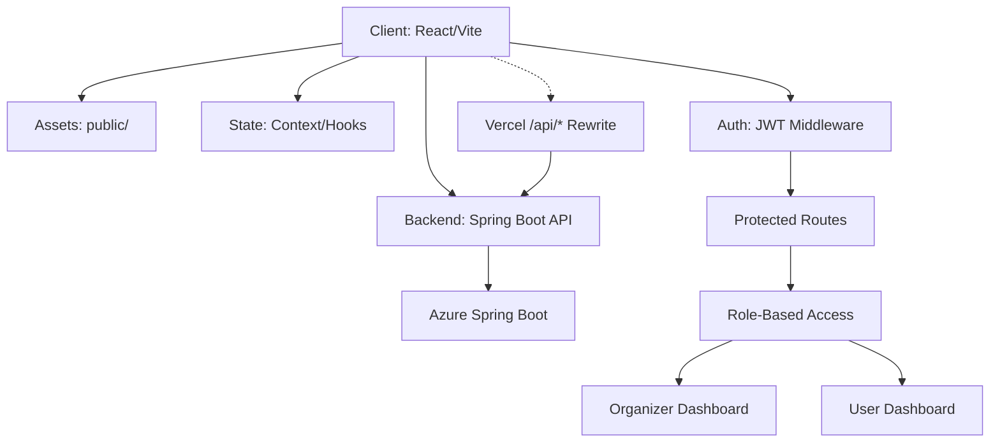

# Eventra

Modern event and hackathon platform for communities, organizers, and contributors.

[](LICENSE)
[](https://react.dev/)
[](https://vitejs.dev/)
[](https://github.com/SandeepVashishtha/Eventra/stargazers)
[](https://github.com/SandeepVashishtha/Eventra/forks)
[](https://github.com/SandeepVashishtha/Eventra/graphs/contributors)
[](https://github.com/SandeepVashishtha/Eventra/issues)
[](https://github.com/SandeepVashishtha/Eventra/pulls)

---

## Project Status Notice

🚧 Eventra is actively maintained and welcomes contributions from the open-source community. Please check existing issues before creating new ones and follow the contribution guidelines when submitting pull requests.

## Quick Start

Get Eventra running locally in under a minute:

```bash
git clone https://github.com/SandeepVashishtha/Eventra.git
cd Eventra
npm install
npm run dev
```

App runs at `http://localhost:3000`.

> See [Local Development](#local-development) for detailed setup instructions and [Common Setup Issues](#common-setup-issues) for troubleshooting.

## Table of Contents

- [Project Status Notice](#project-status-notice)
- [Quick Start](#quick-start)
- [Overview](#overview)
- [Feature Showcase](#feature-showcase)
- [Key Features](#key-features)
- [Tech Stack](#tech-stack)
- [Project Architecture](#project-architecture)
  - [Frontend–Backend Communication](#frontendbackend-communication)
  - [Authentication Flow](#authentication-flow)
  - [Route Protection](#route-protection)
- [Project Structure](#project-structure)
- [Prerequisites](#prerequisites)
- [Local Development](#local-development)
- [Docker Development](#docker-development)
- [Environment Variables](#environment-variables)
- [Available Scripts](#available-scripts)
- [Testing and Quality](#testing-and-quality)
- [SSE Mock Server (Optional)](#sse-mock-server-optional)
- [Deployment](#deployment)
- [Roadmap](#roadmap)
- [Documentation](#documentation)
- [Contributing](#contributing)
  - [Branch Naming](#branch-naming)
  - [Commit Conventions](#commit-conventions)
  - [PR Checklist](#pr-checklist)
- [License](#license)
- [Contributors](#contributors)
- [Maintainers](#maintainers)
- [Mentor](#mentor)
- [Star History](#star-history)

---

## Overview

Eventra is an open-source frontend application built with React and Vite. It supports event discovery, registration, dashboards, hackathons, collaboration features, feedback flows, and role-based access experiences.

This repository contains the frontend application. The Spring Boot backend is maintained in a separate repository — all API traffic is proxied to it both in production (via Vercel rewrites) and in local development (via Vite proxy).

- Frontend repo: <https://github.com/SandeepVashishtha/Eventra>
- Backend repo: <https://github.com/SandeepVashishtha/Eventra-Backend>
- Backend API base: <https://eventra-backend-springboot-eybhdvaubxcua7ha.centralindia-01.azurewebsites.net>
- Swagger: <https://eventra-backend-springboot-eybhdvaubxcua7ha.centralindia-01.azurewebsites.net/swagger-ui/index.html>

## Feature Showcase

Eventra brings together event discovery, hackathon management, and community collaboration in a single platform:

- **Event Management** — Browse, filter, and register for events with detailed views and scheduling.
- **Hackathon Platform** — Dedicated hackathon section with team formation, submissions, and judging workflows.
- **User Dashboard** — Track your contributions, achievements, points, and program progress with GSSoC integration.
- **Organizer Dashboard** — Create and manage events, view registrations, and engage with attendees.
- **Authentication** — Auth-aware routing with protected pages, role-based access, and session management.
- **Notifications** — Real-time and offline-friendly notification system with SSE support.
- **Feedback System** — Rate and review events with rich feedback forms and moderation.

## Key Features

- Event and hackathon discovery, filtering, and registration flows
- Auth-aware routes with protected pages and role-aware behavior
- Dashboard and profile surfaces for users and organizers
- Real-time and offline-friendly UX utilities
- Feedback, recommendation, and community engagement modules
- Extensive utility and behavior test coverage

## Tech Stack

- React 18.2
- React Router 7
- Vite 8
- Tailwind CSS 4
- Framer Motion
- Lucide React
- Playwright (E2E)
- ESLint and Prettier

## Project Architecture

Below is the high-level architecture of Eventra:



### Frontend–Backend Communication

- The React app communicates with the Spring Boot backend via REST API calls.
- In production, `/api/*` requests are rewritten to the Azure-hosted backend via Vercel rewrites.
- In development, Vite proxies API calls to `http://localhost:8080` (see `vite.config.js`).
- Backend URL resolution priority: `BACKEND_URL` → `VITE_API_URL` → `REACT_APP_API_URL` (configured in `src/config/backendConfig.js`).

### Authentication Flow

- JWT-based authentication handled via Edge Middleware and context providers.
- Protected routes check for valid tokens before rendering; unauthenticated users are redirected to login.
- Role-aware behavior distinguishes organizers, contributors, and viewers.
- The server-side `JWT_SECRET` environment variable is used for token signing and validation.

### Route Protection

- Route-level guards in `src/components/` enforce authentication and role requirements.
- Public routes (home, events, hackathons) are accessible without authentication.
- Protected routes (dashboards, organizer panels) require a valid JWT and optionally specific roles.
- Middleware runs at the edge for production builds, validating tokens before requests reach the app.

## Project Structure

```text
Eventra/
|-- docs/                # Architecture, env setup, onboarding, security docs
|-- public/              # Static assets (images, icons, manifests)
|-- scripts/             # Validation and automation scripts
|-- src/
|   |-- Pages/           # Route-level pages (Home, Events, Hackathons, Leaderboard, etc.)
|   |-- components/      # Shared and feature components (Navbar, Footer, Cards)
|   |-- context/         # React context providers (Auth, Theme, Toast)
|   |-- hooks/           # Custom React hooks (useCountdown, useOnlineStatus, etc.)
|   |-- utils/           # Utility modules (formatting, validation, helpers)
|   |-- config/          # Runtime/env config helpers (backend URL resolution)
|   |-- App.jsx          # Root component with route definitions
|   `-- index.jsx        # Application entry point
|-- tests/               # Node-based unit/integration tests (Vitest)
|-- e2e/                 # Playwright end-to-end tests
|-- vite.config.js       # Vite configuration (aliases, proxy, plugins)
|-- vercel.json          # Vercel deployment config (rewrites, headers)
`-- README.md
```

## Prerequisites

- Node.js `>=22.x`
- npm `>=9.6.4`

## Local Development

1. Clone and install:

```bash
git clone https://github.com/SandeepVashishtha/Eventra.git
cd Eventra
npm install
```

1. Create your env file:

```bash
cp .env.example .env
```
> **Tip:** If your operating system does not support `cp`, copy the file manually or use `copy .env.example .env` on Windows.

1. Start dev server:

npm run dev

App runs at `http://localhost:3000` (configured in `vite.config.js`).

## Common Setup Issues

### Dependency Installation Warnings

Some users may see peer dependency or engine warnings during `npm install`. In most cases, the installation still completes successfully.

If installation fails, try:

```bash
npm install --legacy-peer-deps
```

### Port Already in Use

If port `3000` is already occupied, stop the existing process or run:

```bash
npx kill-port 3000
```

### Vite Cache Issues

If the frontend shows unexpected build or parsing errors, clear the Vite cache and restart the server:

```bash
rm -rf node_modules/.vite
npm run dev
```

For Windows PowerShell:

```powershell
Remove-Item -Recurse -Force node_modules/.vite
npm run dev
```

### Environment Variable Issues

Make sure `.env` is created correctly from `.env.example` before starting the development server.

## Docker Development

You can run Eventra fully containerized using Docker Compose to ensure a consistent environment:

1. Clone the repository and setup your environment variables:

```bash
git clone https://github.com/SandeepVashishtha/Eventra.git
cd Eventra
cp .env.example .env
```

1. Start the local development container:

```bash
docker compose up eventra-dev
```

The app will be available at `http://localhost:3000` with hot-reloading enabled.

1. Build and test the production container locally:

```bash
docker compose up --build eventra-prod
```

The production-optimized build will be served via Nginx at `http://localhost:8080`.

## Environment Variables

Use `.env.example` as the source of truth. See [docs/ENV_SETUP_GUIDE.md](docs/ENV_SETUP_GUIDE.md) for detailed configuration information.

| Variable | Required | Purpose |
| --- | --- | --- |
| `BACKEND_URL` | No | Backend origin (highest priority, overrides others) |
| `VITE_API_URL` | No | Backend API base URL (Vite - preferred) |
| `REACT_APP_API_URL` | No | Backend API base URL (CRA compatibility) |
| `REACT_APP_GITHUB_REPO` | No | Public repo identifier used in metadata |
| `REACT_APP_PUBLIC_URL` | No | Canonical public app URL |
| `REACT_APP_VAPID_PUBLIC_KEY` | No | Public web-push key |
| `REACT_APP_CSP_REPORT_URI` | No | CSP report endpoint |
| `REACT_APP_SENTRY_DSN` | No | Sentry browser error reporting DSN, used only in production |
| `JWT_SECRET` | Yes (server-side) | JWT signing secret for Edge Middleware auth verification |
| `DATABASE_URL` | Yes (server-side, production) | Database connection URL for persistent authentication storage |
| `KV_REST_API_URL` | Yes (server-side, production) | Vercel KV/Redis REST API URL for distributed rate limiting |
| `KV_REST_API_TOKEN` | Yes (server-side, production) | Vercel KV/Redis REST API token for distributed rate limiting |
| `BLOCKED_COUNTRIES` | No (server-side) | Comma-separated ISO 3166-1 alpha-2 country codes to block |

Examples:

```env
VITE_API_URL=https://api.example.com
```

or:

```env
BACKEND_URL=https://api.example.com
```

**Backend Configuration**: All backend endpoint configuration is centralized in `src/config/backendConfig.js`. The system resolves backend URLs in priority order: `BACKEND_URL` → `VITE_API_URL` → `REACT_APP_API_URL`. In development, defaults to `http://localhost:8080`. In production, no automatic fallback - configuration must be explicitly set to avoid configuration drift.

Security note: never place private secrets in `REACT_APP_*` or `VITE_*` variables because they are exposed to the client bundle.

### Geographic Access Restrictions

The Edge Middleware supports configurable country-based access restrictions via the `BLOCKED_COUNTRIES` environment variable. This is a server-side configuration that affects all incoming requests.

**Configuration:**
- Set `BLOCKED_COUNTRIES` to a comma-separated list of two-letter ISO 3166-1 alpha-2 country codes
- Leave empty to allow access from all countries (default behavior)
- Country codes are case-insensitive and whitespace is trimmed automatically

**Examples:**
```env
# Block specific countries
BLOCKED_COUNTRIES=CU,IR,KP,SY,RU

# Allow all countries (default)
BLOCKED_COUNTRIES=
```

**Behavior:**
- Requests from blocked countries receive HTTP 451 (Unavailable For Legal Reasons)
- Blocked requests are logged with the country code for monitoring
- Self-hosted deployments can configure this based on their requirements
- No restrictions are applied when the variable is empty or unset

## Available Scripts

| Command | Description |
| --- | --- |
| `npm run dev` | Start local dev server |
| `npm run start` | Alias to Vite dev server |
| `npm run build` | Production build |
| `npm run preview` | Preview production build locally |
| `npm run lint` | Run ESLint on `src/` |
| `npm run lint:fix` | Auto-fix lint issues |
| `npm run format` | Run Prettier on source files |
| `npm run test` | Run unit test suite |
| `npm run test:e2e` | Run Playwright E2E tests |
| `npm run check` | Run lint + tests together (CI validation) |
| `npm run storybook` | Start Storybook |
| `npm run build-storybook` | Build Storybook static output |

## Testing and Quality

```bash
npm run lint
npm run test
npm run test:e2e
```

## SSE Mock Server (Optional)

For local realtime testing:

```bash
node sse-mock-server.js
```

Required environment variables:

- `JWT_SECRET` - JWT signing secret for token generation and validation. Generate with: `openssl rand -base64 32`

Optional environment flags:

- `SSE_MOCK_PORT` (default `8080`)
- `ALLOWED_ORIGIN` (default `http://localhost:3000`)
- `SSE_DEBUG` (`true` or `false`)

## Deployment

Vercel configuration is checked in via [`vercel.json`](vercel.json):

- Build command: `npm run lint && GENERATE_SOURCEMAP=false npm run build`
- Output directory: `build`
- `/api/*` is rewritten to the hosted Spring Boot backend (the sole API provider)
- No serverless functions are deployed — the `api/` directory was removed as dead code

## Roadmap

### Current Goals
- Expand GSSoC contributor dashboard with real-time leaderboard updates
- Improve event discovery with advanced filtering and search
- Enhance organizer tools for event analytics

### Planned Features
- Mobile responsive redesign for core pages
- Dark mode refinements across all surfaces
- In-app notification system with email digests
- Team collaboration features for hackathons
- Performance optimizations (code splitting, lazy loading)

### Future Improvements
- Progressive Web App (PWA) support
- Multi-language internationalization (i18n)
- Integration with calendar apps (Google Calendar, Outlook)
- Community forums and discussion boards

## Documentation

- [Architecture and Roles](docs/ARCHITECTURE_AND_ROLES.md)
- [Environment Setup Guide](docs/ENV_SETUP_GUIDE.md)
- [Frontend Onboarding](docs/frontend-onboarding.md)
- [Security Migration Notes](docs/SECURITY_MIGRATION.md)
- [API Documentation Notes](docs/API_DOCUMENTATION.md)

## Contributing

We welcome contributions from the community! Please follow our guidelines to keep the project maintainable.

- Follow [CODE_OF_CONDUCT.md](CODE_OF_CONDUCT.md)
- Issues may be auto-unassigned after inactivity by workflow: [auto-unassign-stale-issues.yml](.github/workflows/auto-unassign-stale-issues.yml)

### Branch Naming

Use descriptive branch names with a type prefix:

| Prefix | Purpose |
| --- | --- |
| `fix/` | Bug fixes |
| `feat/` | New features |
| `docs/` | Documentation changes |
| `refactor/` | Code refactoring |
| `chore/` | Maintenance, dependencies |
| `test/` | Test additions or fixes |

Example: `feat/add-event-filters`, `fix/navbar-overlap`, `docs/update-readme`

### Commit Conventions

Use conventional commit messages:

```
<type>: <short description>

<optional longer description>
```

Types: `feat`, `fix`, `docs`, `refactor`, `test`, `chore`

Examples:
- `feat: add event search with date filters`
- `fix: resolve navbar overlap on mobile`
- `docs: update environment setup guide`
- `refactor: extract common card component`

### PR Checklist

Before opening a pull request:

- [ ] Changes are scoped to a single purpose (one fix or feature per PR)
- [ ] Code follows existing conventions (linted, formatted)
- [ ] All tests pass: `npm run check`
- [ ] New functionality includes tests where applicable
- [ ] UI changes have been tested in light and dark mode
- [ ] Commit messages follow conventional format
- [ ] PR description clearly explains what and why

## License

Licensed under Apache 2.0. See [LICENSE](LICENSE).

## Contributors

<p align="left">
  <a href="https://github.com/SandeepVashishtha/Eventra/graphs/contributors">
    
  </a>
</p>

### Maintainers

<table>
<tr>
<td align="center">
<a href="https://github.com/sandeepvashishtha">
  
</a><br>
<sub><b>Sandeep Vashishtha</b><br>
<a href="https://www.linkedin.com/in/sandeepvashishtha/" target="_blank">
  
</a>
</sub>
</td>
<td align="center">
<a href="https://github.com/RhythmPahwa14">
  
</a><br>
<sub><b>Rhythm</b><br>
<a href="https://www.linkedin.com/in/rhythmpahwa14/" target="_blank">
  
</a>
</sub>
</td>
</tr>
</table>

## Mentor

Guidance and mentorship for the Eventra project are provided by the project leadership team. Contributors are encouraged to use GitHub Issues and Discussions for questions, suggestions, and collaboration.

## Star History

<a href="https://www.star-history.com/?repos=sandeepvashishtha%2Feventra&type=date&legend=top-left">
 <picture>
   <source media="(prefers-color-scheme: dark)" srcset="https://api.star-history.com/chart?repos=sandeepvashishtha/eventra&type=date&theme=dark&legend=top-left" />
   <source media="(prefers-color-scheme: light)" srcset="https://api.star-history.com/chart?repos=sandeepvashishtha/eventra&type=date&legend=top-left" />
   
 </picture>
</a>

Built by the Eventra community.

---
