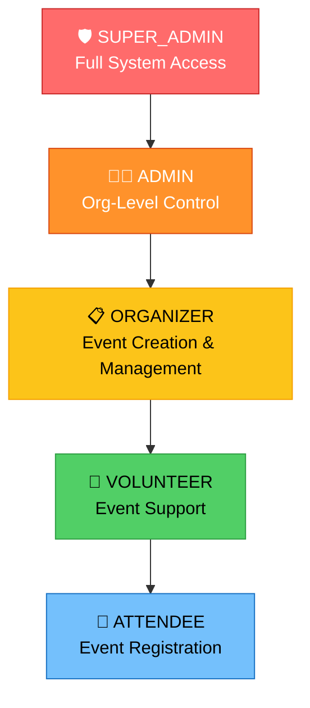
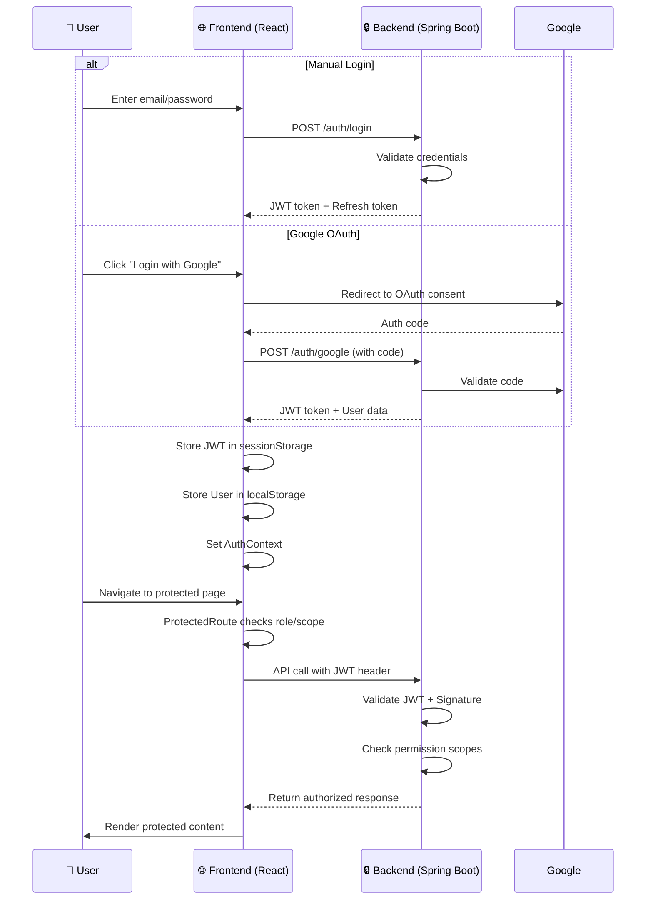
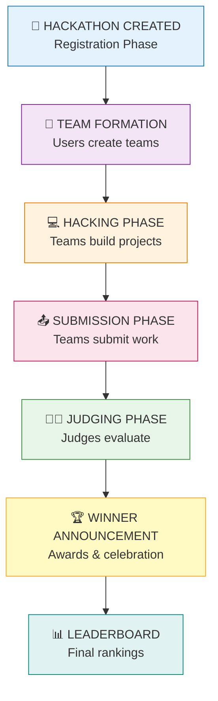
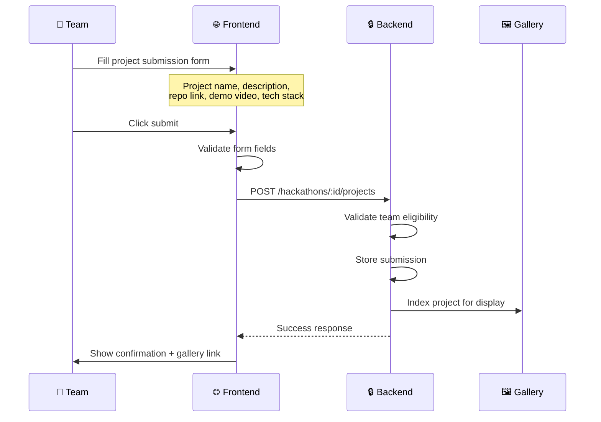
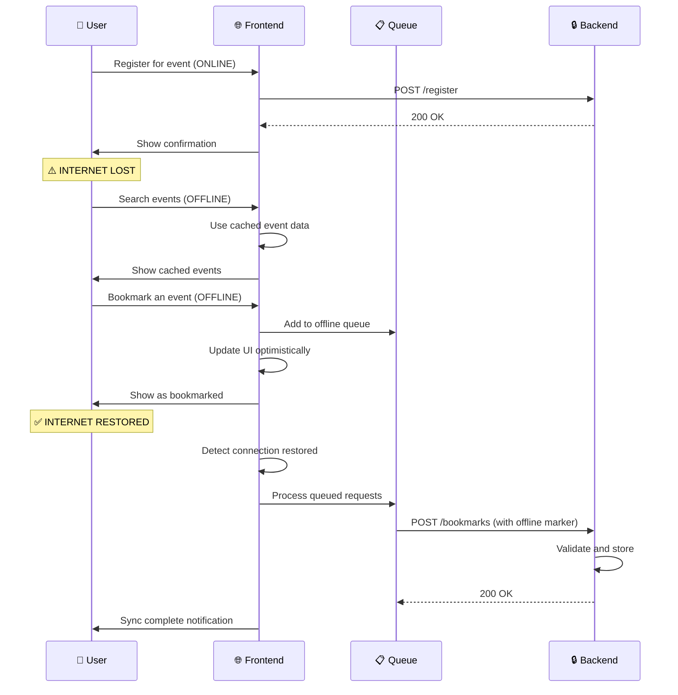

# 🏗️ Eventra Architecture & Roles Guide

Welcome to the **Eventra Architecture Documentation**! This guide is designed to help contributors understand the system's design, role-based access control, event lifecycle, and how all the pieces fit together.

---

## 📌 Introduction

**Eventra** is a sophisticated event management platform built on modern web technologies. Whether you're fixing a bug, adding a feature, or optimizing performance, understanding how the system is structured will help you:

- Navigate the codebase efficiently
- Implement features correctly within role boundaries
- Maintain security and permissions
- Contribute meaningfully to the project

This guide explains **who can do what**, **how events flow through the system**, and **where to find relevant code** for your contributions.

---

## ⚙️ Environment Configuration

Before diving into the architecture, ensure your development environment is properly set up:

**📖 [Environment Setup & Configuration Guide](ENV_SETUP_GUIDE.md)** – Covers:

- Backend API endpoint configuration
- Local development setup (frontend + backend)
- Environment variable reference table
- Troubleshooting connection issues
- Development workflow best practices

---

## 🧩 High-Level System Architecture

Eventra follows a **client-server, context-driven architecture** with JWT-based authentication and offline-first capabilities.

### System Overview

```
┌─────────────────────────────────────────────────────────────┐
│                   EVENTRA PLATFORM                          │
└─────────────────────────────────────────────────────────────┘

┌─────────────────────────────────────────────────────────────┐
│              FRONTEND (React 19 + Router)                   │
│  ┌──────────────────────────────────────────────────────┐  │
│  │         Pages (Events, Hackathons, Dashboard)        │  │
│  └────────────────────┬─────────────────────────────────┘  │
│                       │                                     │
│  ┌────────────────────▼─────────────────────────────────┐  │
│  │    Context Providers & State Management              │  │
│  │  ├─ AuthContext (JWT, User, Role, Permissions)       │  │
│  │  ├─ MyEventsContext (User Event Data)                │  │
│  │  ├─ ThemeContext (Dark/Light Mode)                   │  │
│  │  ├─ NotificationContext (Toasts & Bells)             │  │
│  │  ├─ SessionRecoveryContext (Browser Storage)         │  │
│  │  └─ RealTimeContext (Live Updates)                   │  │
│  └────────────────────┬─────────────────────────────────┘  │
│                       │                                     │
│  ┌────────────────────▼─────────────────────────────────┐  │
│  │    Route Protection & Guards                         │  │
│  │  ├─ ProtectedRoute (Role & Permission Validation)    │  │
│  │  ├─ useAuth Hook (Token & Session Management)        │  │
│  │  └─ useOfflineSync (Request Queue)                   │  │
│  └────────────────────┬─────────────────────────────────┘  │
│                       │                                     │
│  ┌────────────────────▼─────────────────────────────────┐  │
│  │    Reusable Components & Hooks                       │  │
│  │  ├─ auth/ (Login, Signup, OAuth)                     │  │
│  │  ├─ events/ (Cards, Filters, Registration)           │  │
│  │  ├─ admin/ (Dashboard, Management)                   │  │
│  │  └─ common/ (Modals, Buttons, Loaders)               │  │
│  └────────────────────┬─────────────────────────────────┘  │
└─────────────────────────────────────────────────────────────┘
                        │ Axios + API Layer
                        │ (Request Queue, Retry Logic)
                        │
┌─────────────────────────────────────────────────────────────┐
│            BACKEND (Spring Boot + MySQL)                    │
│  ├─ Authentication Service (JWT Validation)                │
│  ├─ Event Management Service                               │
│  ├─ Hackathon Service                                      │
│  ├─ User & Role Service (RBAC Enforcement)                │
│  ├─ Analytics Service                                      │
│  └─ Feedback & Notification Service                        │
└─────────────────────────────────────────────────────────────┘
```

### Key Layers Explained

| Layer | Responsibility | Key Files |
|-------|---|---|
| **Pages** | Feature-specific UIs (Events, Hackathons, Dashboard, etc.) | `src/Pages/*` |
| **Context API** | Global state management (Auth, Events, Theme, Notifications) | `src/context/*` |
| **Route Guards** | Permission validation, role checking, protected navigation | `src/components/auth/ProtectedRoute.js` |
| **Components** | Reusable, domain-specific UI elements | `src/components/*` |
| **Hooks** | Shared logic (Auth, Offline Sync, Filters, Validation) | `src/hooks/*` |
| **Utils** | Helper functions (JWT decode, Event status, CSV export) | `src/utils/*` |
| **API Layer** | Axios configuration, endpoint definitions, error handling | `src/config/api.js` |
| **Backend** | Business logic, RBAC enforcement, data persistence | External Spring Boot service |

---

## 👥 Role-Based Access Control (RBAC)

Eventra uses a **hierarchical role system** with granular **permission scopes** to control what users can do.

### Role Hierarchy



### Detailed Role Permissions Matrix

| Feature | SUPER_ADMIN | ADMIN | ORGANIZER | VOLUNTEER | ATTENDEE |
|---------|:-----------:|:-----:|:---------:|:---------:|:--------:|
| **Create Events** | ✅ | ✅ | ✅ | ❌ | ❌ |
| **Edit Own Events** | ✅ | ✅ | ✅ | ❌ | ❌ |
| **Delete Events** | ✅ | ✅ | ❌ | ❌ | ❌ |
| **Approve Event Registrations** | ✅ | ✅ | ✅ | ❌ | ❌ |
| **Manage Hackathons** | ✅ | ✅ | ✅ | ❌ | ❌ |
| **Submit Hackathon Project** | ✅ | ✅ | ✅ | ✅ | ✅ |
| **Access Analytics Dashboard** | ✅ | ✅ | ✅ | ❌ | ❌ |
| **Manage Users & Roles** | ✅ | ✅ | ❌ | ❌ | ❌ |
| **Access Feedback/Surveys** | ✅ | ✅ | ✅ | ❌ | ❌ |
| **View Leaderboard** | ✅ | ✅ | ✅ | ✅ | ✅ |
| **Register for Events** | ✅ | ✅ | ✅ | ✅ | ✅ |
| **Post Feedback** | ✅ | ✅ | ✅ | ✅ | ✅ |
| **View Own Dashboard** | ✅ | ✅ | ✅ | ✅ | ✅ |
| **Manage Volunteers** | ✅ | ✅ | ✅ | ❌ | ❌ |
| **View User Activity Logs** | ✅ | ✅ | ❌ | ❌ | ❌ |

### Permission Scopes (Granular Controls)

Permission scopes define what API actions a role can perform:

```javascript
// Example permission scopes (from src/config/roles.js)

SUPER_ADMIN: {
  scopes: ['admin:all'],  // Full system access
}

ADMIN: {
  scopes: [
    'event:create',
    'event:edit',
    'event:read',
    'hackathon:manage',
    'user:manage',
    'analytics:view',
  ],
}

ORGANIZER: {
  scopes: [
    'event:create',
    'event:edit',
    'event:read',
    'hackathon:manage',
    'analytics:view',
  ],
}

VOLUNTEER: {
  scopes: [
    'event:read',
    'hackathon:submit',
  ],
}

ATTENDEE: {
  scopes: [
    'event:read',
    'event:register',
    'hackathon:submit',
    'feedback:submit',
  ],
}
```

### How Permission Checking Works

1. **Frontend Check** (Fast, User Experience)
   - `AuthContext` decodes JWT and extracts role/scopes
   - `useAuth()` hook provides `canAccess(scope)` and `hasRole(role)`
   - Components conditionally render based on permissions
   - Routes are protected with `<ProtectedRoute>`

2. **Backend Check** (Security, Server Validation)
   - Spring Boot validates JWT token
   - Checks role and scopes for each endpoint
   - Returns 403 Forbidden if unauthorized
   - Never trusts client-side permission claims

```javascript
// Frontend example (src/components/routes/ProtectedRoute.js)
const ProtectedRoute = ({ requiredRole, requiredScopes, children }) => {
  const { user, hasRole, canAccess } = useAuth();
  
  const isAuthorized = 
    (requiredRole && hasRole(requiredRole)) ||
    (requiredScopes && requiredScopes.some(s => canAccess(s)));
  
  if (!isAuthorized) {
    return <Navigate to="/unauthorized" />;
  }
  
  return children;
};
```

---

## 🔐 Route Protection & Authentication Flow

### Authentication Architecture

Eventra uses **JWT (JSON Web Tokens)** with optional **Google OAuth** for sign-in. Here's how it works:



### Protected Route Structure

```javascript
// Usage in AppRoutes.js
<Route
  path="/admin/dashboard"
  element={
    <ProtectedRoute requiredRole="ADMIN">
      <AdminDashboard />
    </ProtectedRoute>
  }
/>

<Route
  path="/events/create"
  element={
    <ProtectedRoute requiredScopes={['event:create']}>
      <CreateEvent />
    </ProtectedRoute>
  }
/>
```

### Token Storage Strategy

| Storage | Content | Security | Lifetime |
|---------|---------|----------|----------|
| **sessionStorage** | JWT Access Token | Cleared on browser close | ≈ 15-60 min |
| **localStorage** | User object, Theme, Bookmarks | Survives browser close | Persistent |
| **Server** | Refresh Token (httpOnly cookie) | Not accessible to JS | ≈ 7-30 days |

### Session Recovery Flow

When a user refreshes the page:

1. **App initializes** → Checks `sessionStorage` for JWT
2. **If JWT found:** Load from session (fast)
3. **If JWT missing but user in localStorage:**
   - Send stored user data to backend
   - Backend validates and issues new JWT
   - Restore session automatically (transparent to user)
4. **If both missing:** Redirect to login

This is handled by `SessionRecoveryContext`:

```javascript
// src/context/SessionRecoveryContext.js
useEffect(() => {
  const recoverSession = async () => {
    const token = sessionStorage.getItem('jwt');
    const user = localStorage.getItem('user');
    
    if (!token && user) {
      // Validate stored user and get new JWT
      const newToken = await backend.validateSession(JSON.parse(user));
      sessionStorage.setItem('jwt', newToken);
    }
  };
  
  recoverSession();
}, []);
```

---

## 🎟️ Event Lifecycle System

Every event in Eventra goes through a **well-defined lifecycle** to ensure proper moderation, user management, and data collection.

### Event Stages & Workflow

```mermaid
graph LR
    Draft["📝<br/>DRAFT<br/>Creating"] 
    Review["👀<br/>REVIEW<br/>Pending approval"]
    RegOpen["📋<br/>REGISTRATION OPEN<br/>Users can register"]
    Live["🔴<br/>LIVE<br/>Event running"]
    Feedback["📝<br/>FEEDBACK<br/>Collecting responses"]
    Archived["📦<br/>ARCHIVED<br/>Complete"]
    Analytics["📊<br/>ANALYTICS<br/>Historical data"]
    
    Draft -->|Submit| Review
    Review -->|Approve| RegOpen
    RegOpen -->|Start event| Live
    Live -->|Send survey| Feedback
    Feedback -->|Close feedback| Archived
    Archived -->|View reports| Analytics
    
    style Draft fill:#e7f5ff,stroke:#1971c2
    style Review fill:#fff3e0,stroke:#f57c00
    style RegOpen fill:#f3e5f5,stroke:#6a1b9a
    style Live fill:#ffebee,stroke:#c62828
    style Feedback fill:#e8f5e9,stroke:#2e7d32
    style Archived fill:#f5f5f5,stroke:#424242
    style Analytics fill:#e0f2f1,stroke:#00796b
```



### Detailed Stage Breakdown

#### 1. **Draft** 📝

- **Who Can Access:** Event creator, ADMIN
- **What Happens:**
  - Event form is incomplete
  - Auto-saving to browser local storage
  - No one else can see it
  - Can delete without trace
- **Transitions To:** REVIEW
- **Key Properties:** `status: 'DRAFT'`, `isPublished: false`

#### 2. **Review** 👀

- **Who Can Access:** Event creator, ADMIN, SUPER_ADMIN
- **What Happens:**
  - Submitted for approval
  - Admin reviews for content, compliance, and settings
  - Comments/feedback may be provided
  - Creator can edit and resubmit
- **Transitions To:** REGISTRATION_OPEN (approved) or DRAFT (rejected)
- **Key Properties:** `status: 'REVIEW'`, `reviewedBy: admin_id`, `reviewNotes: string`

#### 3. **Registration Open** 📋

- **Who Can Access:** All users (public), registrations visible to organizer
- **What Happens:**
  - Event is published and visible to everyone
  - Users can view and register
  - Organizer can view attendee list
  - Can still edit event details
  - Capacity management enforced
- **Transitions To:** LIVE (event starts), CANCELLED (rare)
- **Key Properties:** `status: 'REGISTRATION_OPEN'`, `capacity: number`, `registeredCount: number`

#### 4. **Live** 🔴

- **Who Can Access:** Organizer, registered attendees, volunteers
- **What Happens:**
  - Event is currently happening
  - Real-time updates and notifications
  - Organizer can broadcast announcements
  - Attendance tracking enabled
  - Volunteer coordination
- **Transitions To:** FEEDBACK
- **Key Properties:** `status: 'LIVE'`, `startTime: timestamp`, `isLive: true`

#### 5. **Feedback** 📝

- **Who Can Access:** Registered attendees (survey), organizer (view responses)
- **What Happens:**
  - Event has ended
  - Surveys/feedback forms are sent to attendees
  - Responses are collected and analyzed
  - Event media/photos can be shared
  - Leaderboard updates for hackathons
- **Transitions To:** ARCHIVED
- **Key Properties:** `status: 'FEEDBACK'`, `feedbackFormId: string`, `surveyResponses: array`

#### 6. **Archived** 📦

- **Who Can Access:** Everyone (read-only), full history available
- **What Happens:**
  - Event is complete
  - Historical data preserved
  - Analytics available to organizer
  - Cannot edit, register, or modify
  - Available for reference
- **Transitions To:** ANALYTICS (data processing)
- **Key Properties:** `status: 'ARCHIVED'`, `archiveDate: timestamp`

#### 7. **Analytics** 📊

- **Who Can Access:** Organizer, ADMIN, SUPER_ADMIN
- **What Happens:**
  - Post-event reports generated
  - Attendance trends analyzed
  - Feedback sentiment analysis
  - ROI calculations
  - Historical comparisons
- **Key Properties:** `analytics: { attendance, feedback, ratings, roi }`

### Event State Transitions (Code Example)

```javascript
// src/utils/eventUtils.js
const EVENT_STATUSES = {
  DRAFT: 'DRAFT',
  REVIEW: 'REVIEW',
  REGISTRATION_OPEN: 'REGISTRATION_OPEN',
  LIVE: 'LIVE',
  FEEDBACK: 'FEEDBACK',
  ARCHIVED: 'ARCHIVED',
  CANCELLED: 'CANCELLED',
};

const canTransitionTo = (currentStatus, newStatus, userRole) => {
  const transitions = {
    DRAFT: ['REVIEW', 'DELETED'],
    REVIEW: ['REGISTRATION_OPEN', 'DRAFT'],
    REGISTRATION_OPEN: ['LIVE', 'CANCELLED'],
    LIVE: ['FEEDBACK'],
    FEEDBACK: ['ARCHIVED'],
    ARCHIVED: ['ANALYTICS'],
  };
  
  const isAllowedTransition = transitions[currentStatus]?.includes(newStatus);
  const isAuthorized = ['ADMIN', 'SUPER_ADMIN', 'ORGANIZER'].includes(userRole);
  
  return isAllowedTransition && isAuthorized;
};
```

---

## 🏆 Hackathon Hub Workflow

Hackathons are specialized events with unique workflows, team dynamics, and judging mechanisms.

### Hackathon Lifecycle



### Hackathon Stages & Features

| Stage | Duration | Who Participates | Key Actions |
|-------|----------|---|---|
| **Registration** | Days | Organizers + Attendees | Create hackathon, participants sign up |
| **Team Formation** | Days | Attendees | Create/join teams, set team goals |
| **Hacking** | Hours/Days | Volunteer + Attendees | Build projects, real-time collaboration |
| **Submission** | Hours | Teams | Submit project links, descriptions, demo videos |
| **Judging** | Hours | ADMIN + Assigned Judges | Evaluate submissions, score criteria |
| **Announcement** | Hours | Everyone | Winner declaration, certificates, prizes |
| **Leaderboard** | Persistent | Everyone | View final rankings, achievements |

### Team Management

```javascript
// Team structure in backend
{
  id: 'team-123',
  hackathonId: 'hack-456',
  teamName: 'Code Warriors',
  leader: { id: 'user-1', name: 'Alice' },
  members: [
    { id: 'user-1', role: 'LEADER' },
    { id: 'user-2', role: 'MEMBER' },
    { id: 'user-3', role: 'MEMBER' },
  ],
  maxMembers: 5,
  status: 'ACTIVE', // ACTIVE, DISBANDED, SUBMITTED
  createdAt: timestamp,
}
```

### Project Submission Flow



### Judging & Leaderboard

```javascript
// Judging criteria (configurable per hackathon)
{
  innovationScore: { weight: 0.30, maxScore: 10 },
  executionScore: { weight: 0.25, maxScore: 10 },
  usabilityScore: { weight: 0.20, maxScore: 10 },
  presentationScore: { weight: 0.15, maxScore: 10 },
  customScore: { weight: 0.10, maxScore: 10 },
}

// Final ranking calculation
finalScore = 
  (innovationScore * 0.30) +
  (executionScore * 0.25) +
  (usabilityScore * 0.20) +
  (presentationScore * 0.15) +
  (customScore * 0.10)
```

---

## 📊 Analytics & Feedback System

### Analytics Dashboard (ADMIN + ORGANIZER Access)

**Event Analytics:**

- Total registrations over time (Recharts line chart)
- Registration by source (Recharts pie chart)
- Attendee demographics
- Location distribution
- Cancellation/no-show rates
- Average rating & sentiment

**Hackathon Analytics:**

- Team participation trends
- Project submission status
- Judge scoring distribution
- Winning team profiles
- Average hackathon score

**Query Example:**

```javascript
// Frontend (src/Pages/Events/EventAnalytics.jsx)
const [analyticsData, setAnalyticsData] = useState(null);

useEffect(() => {
  const fetchAnalytics = async () => {
    const response = await api.get(`/events/${eventId}/analytics`);
    setAnalyticsData(response.data);
  };
  fetchAnalytics();
}, [eventId]);

// Render with Recharts
<LineChart data={analyticsData.registrationsTrend}>
  <CartesianGrid />
  <XAxis />
  <YAxis />
  <Line type="monotone" dataKey="count" stroke="#8884d8" />
</LineChart>
```

### Feedback Collection

**Feedback Types:**

- Post-event surveys (customizable)
- NPS (Net Promoter Score)
- Satisfaction ratings (1-5 stars)
- Open-ended comments
- Photo/media uploads

**Survey Trigger:**

1. Event enters FEEDBACK stage
2. Automated emails sent to attendees
3. In-app notification bell activated
4. Survey link provided
5. Responses collected in real-time
6. Sentiment analysis performed

### Export Capabilities

- **CSV Export:** Attendee lists, feedback responses
- **PDF Export:** Event certificates, summary reports
- **Calendar Export:** iCal format for personal calendars
- **QR Codes:** Event registration links

---

## 🌐 Real-Time & Offline Features

### Offline-First Architecture

Eventra works seamlessly even when internet connection is lost:



### Notification System

**Notification Types:**

- Event reminders (24h, 1h before)
- Registration confirmation
- Team invitations
- Hackathon phase changes
- Winner announcements
- Feedback request
- System alerts

**Implementation:**

```javascript
// src/context/NotificationContext.js
const NotificationContext = createContext();

const useNotification = () => {
  const { addNotification } = useContext(NotificationContext);
  
  const notifyEventStart = (eventId) => {
    addNotification({
      type: 'EVENT_REMINDER',
      title: 'Event Starting Soon!',
      message: `${eventName} starts in 1 hour`,
      actionUrl: `/events/${eventId}`,
      icon: '🔔',
    });
  };
  
  return { notifyEventStart };
};
```

### Real-Time Updates

Real-time data sync is handled through:

1. **Polling (Fallback):** Periodic API calls every 30 seconds
2. **WebSockets (Preferred):** Direct server push when available
3. **SSE (Server-Sent Events):** One-way server-to-client stream

```javascript
// Real-time event updates
const RealTimeContext = createContext();

const RealTimeProvider = ({ children }) => {
  useEffect(() => {
    const eventSource = new EventSource('/api/events/live');
    
    eventSource.on('event:registered', (e) => {
      updateAttendeeCount(JSON.parse(e.data));
    });
    
    eventSource.on('event:announced', (e) => {
      addNotification(JSON.parse(e.data));
    });
    
    return () => eventSource.close();
  }, []);
  
  return <RealTimeContext.Provider>{children}</RealTimeContext.Provider>;
};
```

---

## 🧠 Contributor Notes & Code Map

### Key Directories for Contributors

| Directory | Purpose | Key Files |
|-----------|---------|-----------|
| **src/context** | Global state & authentication | `AuthContext.js`, `MyEventsContext.js`, `SessionRecoveryContext.js` |
| **src/hooks** | Custom React logic | `useAuth.js`, `useOfflineSync.js`, `useFilters.js` |
| **src/components/auth** | Login, signup, OAuth | `LoginForm.js`, `GoogleOAuthButton.js`, `SignupForm.js` |
| **src/components/routes** | Route protection & navigation | `ProtectedRoute.js`, `AppRoutes.js` |
| **src/components/admin** | Admin dashboard & management | `AdminDashboard.js`, `UserManagement.js` |
| **src/components/events** | Event-specific UI | `EventCard.js`, `EventFilters.js`, `EventRegistration.js` |
| **src/utils** | Helper functions & transformations | `auth.js`, `eventUtils.js`, `offlineQueue.js` |
| **src/config** | Configuration & constants | `api.js`, `roles.js`, `chatbotKnowledge.js` |
| **src/Pages** | Full-page components | `Events/`, `Hackathons/`, `Dashboard/` |

### Common Contributor Tasks & Where to Code

#### 🔐 Adding a New Permission

1. Update `src/config/roles.js` - add to scopes
2. Update `useAuth()` hook - add `canAccess()` check
3. Protect route in `AppRoutes.js` with `<ProtectedRoute requiredScopes>`
4. Update backend Spring Boot service
5. Update role table in this documentation

#### 🎟️ Changing Event Lifecycle

1. Update event status enum in backend
2. Modify `src/utils/eventUtils.js` - add status constant
3. Update state machine in `canTransitionTo()` function
4. Modify event pages to handle new status
5. Update this documentation with new workflow

#### 💬 Adding New Feedback Fields

1. Design form in `src/Pages/Feedback/`
2. Create Recharts visualization for new metric
3. Update `src/utils/exportCsv.js` to include new field
4. Extend backend feedback model
5. Update analytics dashboard

#### 🧭 Creating Protected Admin Page

```javascript
// In AppRoutes.js
<Route
  path="/admin/custom-page"
  element={
    <ProtectedRoute requiredRole="ADMIN">
      <YourCustomComponent />
    </ProtectedRoute>
  }
/>

// Create YourCustomComponent in src/components/admin/
// Use useAuth() hook for current user info
// Use API layer (src/config/api.js) for backend calls
```

#### 🔌 Adding New API Endpoint Integration

```javascript
// In src/config/api.js
const endpoints = {
  // ... existing endpoints
  customFeature: {
    create: () => `/custom-feature`,
    getById: (id) => `/custom-feature/${id}`,
    update: (id) => `/custom-feature/${id}`,
  },
};

// In your component
const { data } = await api.post(endpoints.customFeature.create(), payload);
```

### Authentication Flow for Contributors

**To understand user flow:**

1. User logs in → `LoginForm.js` submits credentials
2. Backend returns JWT → `AuthContext` stores it
3. `SessionRecoveryContext` recovers on page reload
4. `ProtectedRoute` checks permissions
5. Components use `useAuth()` for role info

**To debug auth issues:**

1. Check `AuthContext.js` for user/token state
2. Verify JWT in browser DevTools → Application → sessionStorage
3. Check `src/utils/auth.js` for token validation logic
4. Verify role normalization in `AuthContext`

---

## 📱 Dashboard Access by Role

### SUPER_ADMIN Dashboard

- Complete system overview
- All user management
- Event moderation queue
- System health & analytics
- Role assignment controls
- Revenue reports

### ADMIN Dashboard

- Organization overview
- Events under administration
- Attendee management
- Feedback analytics
- Volunteer coordination
- Hackathon administration

### ORGANIZER Dashboard

- My Events (created)
- Attendee lists (per event)
- Event analytics
- Feedback & survey results
- My Hackathons
- Team management

### VOLUNTEER Dashboard

- Assigned events
- Task list
- Team notifications
- Hackathon submissions
- Leaderboard position

### ATTENDEE Dashboard

- Registered events
- Event reminders
- Feedback surveys
- Achievement badges
- Leaderboard ranking
- Saved (bookmarked) events

---

## 🚀 Future Improvements & Enhancement Ideas

### Short-Term (Next Sprint)

- **Advanced Scheduling:** Drag-and-drop event rescheduling
- **Email Notifications:** Automated email confirmations
- **Event Templates:** Pre-built event templates for quick creation
- **Bulk Actions:** Manage multiple events at once

### Medium-Term (Next Quarter)

- **Mobile App:** React Native mobile application
- **Payment Integration:** Stripe/Razorpay for ticketed events
- **Event Sponsorship:** Sponsor dashboard and ROI tracking
- **AI Chatbot:** Intelligent event Q&A powered by LLMs
- **Social Features:** Event follow, share, and ratings

### Long-Term (Roadmap)

- **Virtual Event Support:** Livestream integration (YouTube Live, Zoom)
- **Blockchain Certificates:** NFT-based achievement badges
- **Machine Learning:** Attendee recommendation engine
- **Global Multi-Language:** i18n support for worldwide events
- **Advanced Analytics:** Predictive analytics for event success
- **API Marketplace:** Third-party integrations and webhooks

---

## 📖 Additional Resources

- **[CONTRIBUTING.md](../CONTRIBUTING.md)** – How to contribute
- **[SECURITY.md](../SECURITY.md)** – Security guidelines
- **[CHANGELOG.md](../CHANGELOG.md)** – Version history
- **[Backend API Docs](https://eventra-backend-springboot-eybhdvaubxcua7ha.centralindia-01.azurewebsites.net/swagger-ui/index.html)** – Spring Boot Swagger
- **[GitHub Issues](https://github.com/SandeepVashishtha/Eventra/issues)** – Report bugs & request features

---

## 💬 Need Help?

- **Start Contributing:** Check [CONTRIBUTING.md](../CONTRIBUTING.md)
- **Ask Questions:** Open a discussion or ping maintainers
- **Report Issues:** Use [GitHub Issues](https://github.com/SandeepVashishtha/Eventra/issues) with detailed context
- **Security Concerns:** See [SECURITY.md](../SECURITY.md) for responsible disclosure

---

**Last Updated:** May 2026  
**Maintainers:** Eventra Core Team  
**License:** See [LICENSE](../LICENSE)
