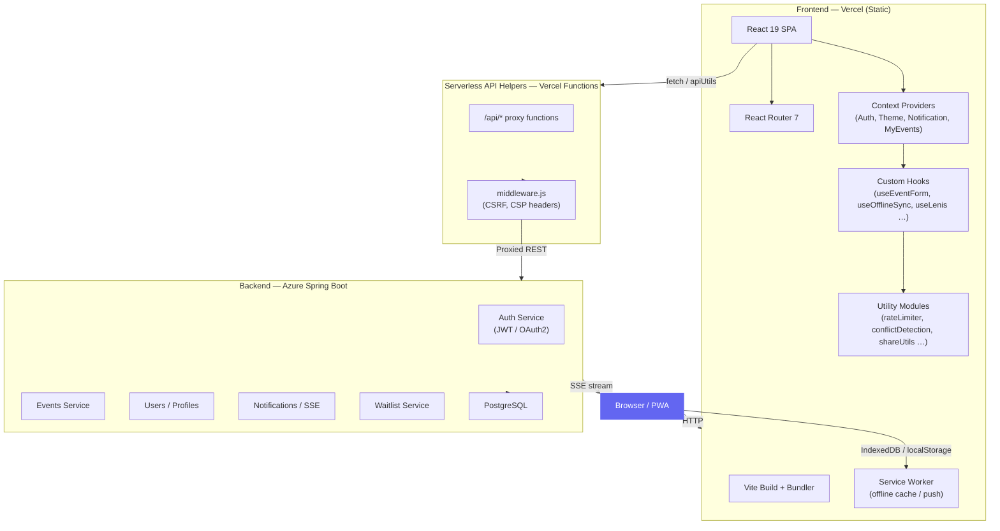
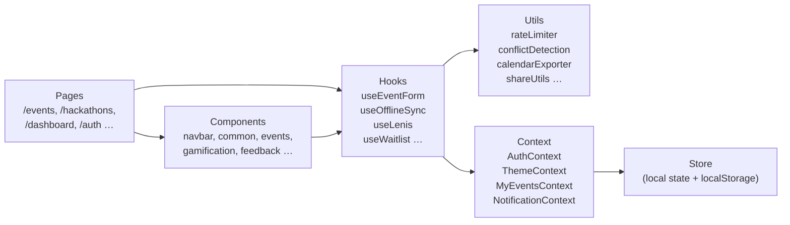
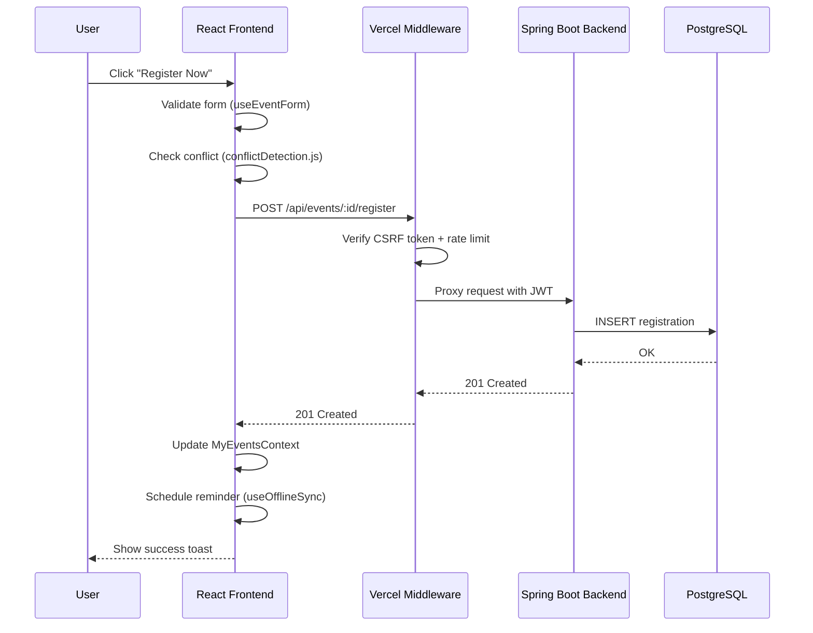
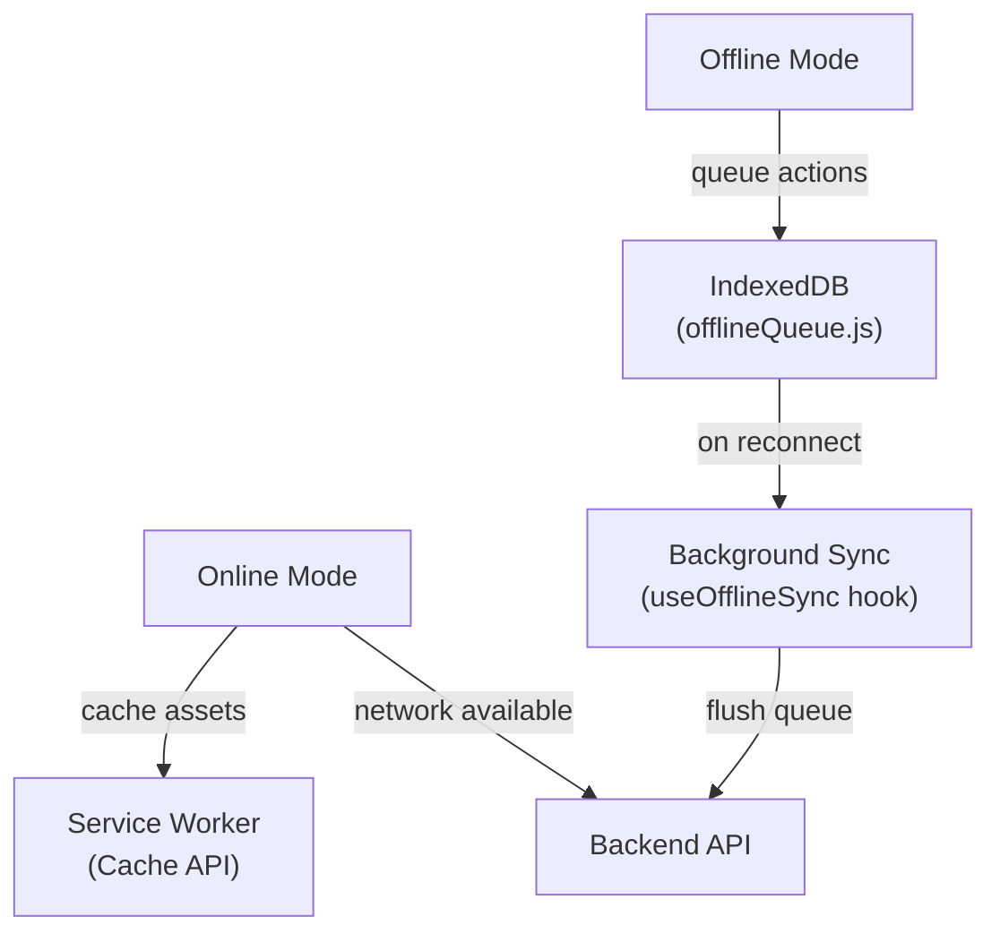

# Project Architecture

## Overview

Eventra is a React/Vite frontend that connects to a Spring Boot backend over REST. The frontend is fully static and hosted on Vercel; the backend runs on Azure.

---

## High-Level System Architecture

---

## Frontend Layer Breakdown

---

## Data Flow: Event Registration

---

## Offline Support Architecture

---

## Security Layers

| Layer | Mechanism |
|---|---|
| Transport | HTTPS only; HSTS via Vercel headers |
| Auth | JWT Bearer tokens; refresh via HttpOnly cookie |
| CSRF | Double-submit cookie pattern in `middleware.js` |
| Input | `inputSanitization.js` + `sanitizeHtml.js` |
| Rate Limiting | Token-bucket `rateLimiter.js` on hot endpoints |
| CSP | Strict Content-Security-Policy via `cspReporting.js` |
| Secrets | No secrets in `VITE_*` or `REACT_APP_*` env vars |

---

## Key Technology Decisions

| Decision | Rationale |
|---|---|
| Vite 8 over CRA | 10× faster HMR; native ESM |
| React Router 7 | Nested layouts, data loaders, and code splitting |
| Tailwind CSS 4 | Utility-first; zero unused CSS in production build |
| Framer Motion | Declarative animations with reduced-motion support |
| IndexedDB for offline queue | Persistent across browser restarts; survives tab close |
| Token-bucket rate limiter | Prevents client-side API spam without a server round-trip |
